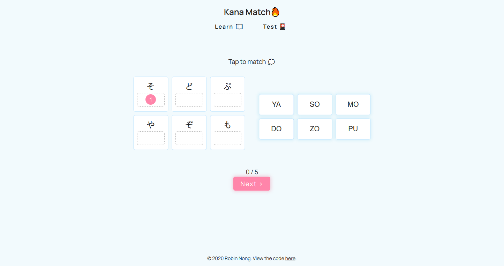

# Kana Match
 

A beginner Hiragana learning application and quiz written in vanilla Javascript. Currently migrating project to Vue. A work in progress, no yet mobile compatible.  
Live link 👉<a href="https://robinnong.github.io/kana-match/">here</a>👈

## Features
- Learning with a Hiragana chart displaying different sounds and equivalent english (romaji) pronounciation
- Quiz with 5 rounds of random hiragana matching
- Project as an exercise for using ES6 modules and bundling with Webpack

### To Do
- Responsiveness
- Accessibility audit
- Incorporate Katakana charts
- Add a Kanji learning section and calls to an API to receive kanji information

### Improvements from Vanilla JS to Vue
- Discontinued Drag and Drop feature in quiz and implemented "Tap to Match" feature for improved accessibility. 
- Switch from manipulating the DOM with vanilla js query selectors and storing all DOM changes in the Vue object's state. 

## How to use this repository

Clone the repository and ensure the latest version of Node.js is installed on your machine.
Run npm install to install all dependecies. 

In the project directory, you can run:

### npm run build 
Builds the app for production to the dist folder.  
